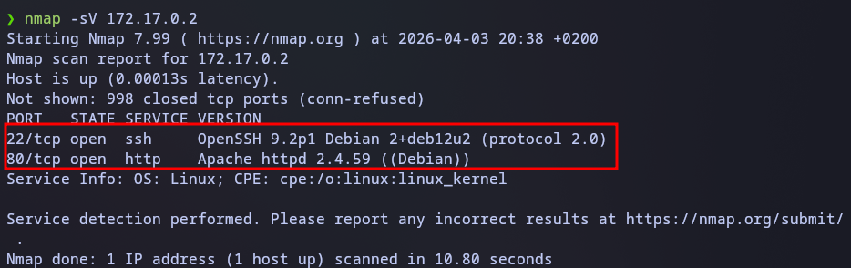
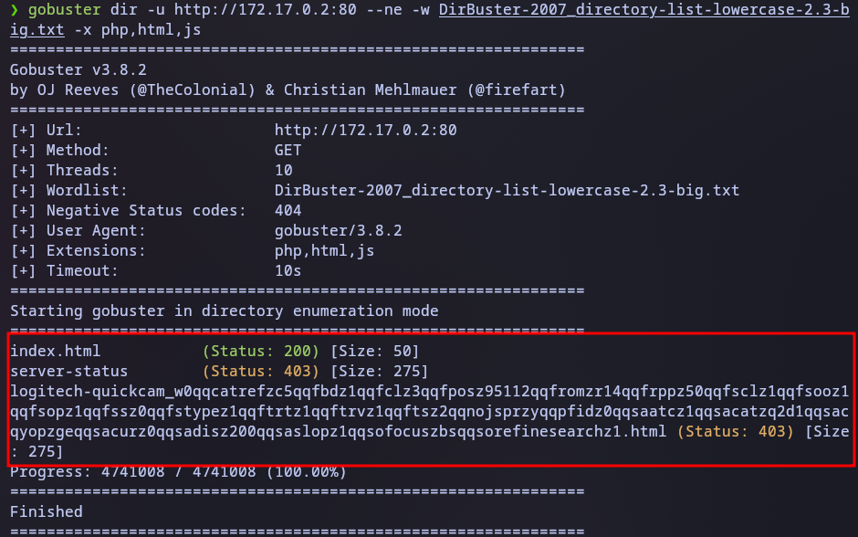
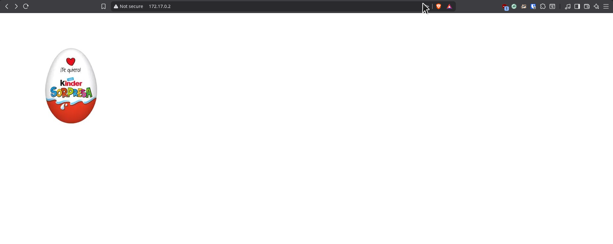
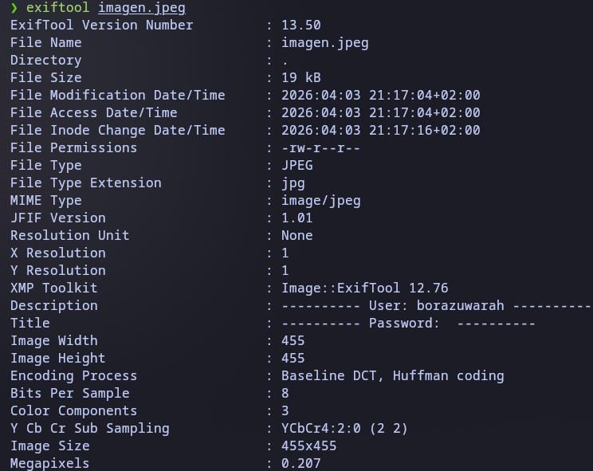
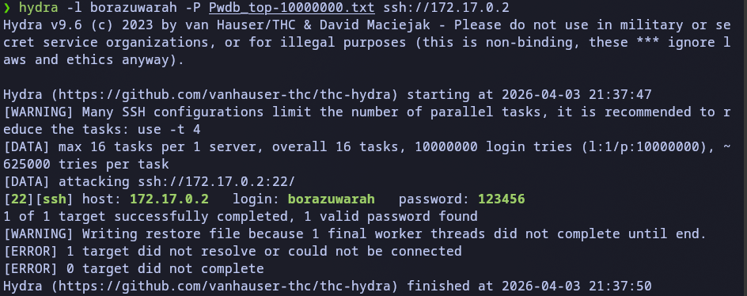
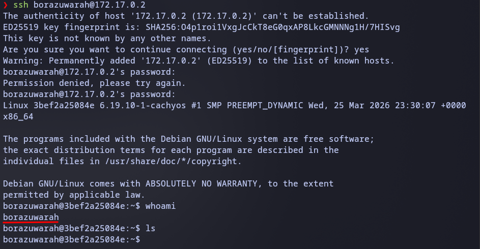
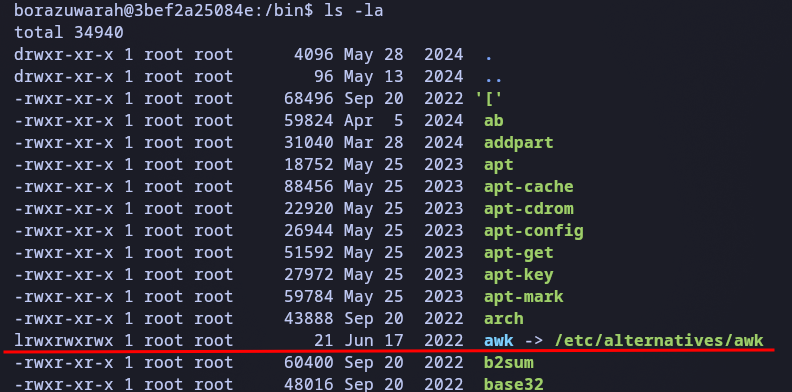
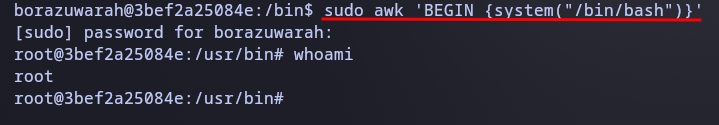

# Borazuwarah lab

src: https://dockerlabs.es/

## Scanning and Enumeration
We start by checking which services are running on the victim host using nmap with the -sV flag to get the software versions.

Command: nmap -sV 



## Web Enumeration & Metadata
We begin by analyzing the web server, performing a directory enumeration.




On the index.php page, we analyze the image with exiftool to extract metadata and search for a username.




Finding: The image owner is borazuwarah. We can now attempt a brute-force attack on SSH.

## Exploitation (SSH)
As usual, MaxAuthTries is not configured (common in easy labs), allowing us to perform a brute-force attack.




Result: Password found -> 123456.

## Privilege Escalation
We perform internal enumeration to find a way to escalate privileges.



Any user can execute awk with superuser permissions, so we run the following command to spawn a root shell:
```Bash
sudo awk 'BEGIN {system("/bin/bash")}'
```



## Notes
Example 1:

```Bash
root@3bef2a25084e:/usr/bin# awk 'BEGIN {system("echo Hola")}'
Hola
```
In awk, the BEGIN command allows you to pause awk and execute something before reading any file. That "something" can be anything, and we can chain it with the system() function, which is used to interact with the system.

Example 2:

```Bash
root@3bef2a25084e:/usr/bin# awk 'system("echo Hola")'
this is text I typed
Hola
```
Without BEGIN, awk stays waiting for input (a file or text to analyze). It will only execute the command after receiving data.
