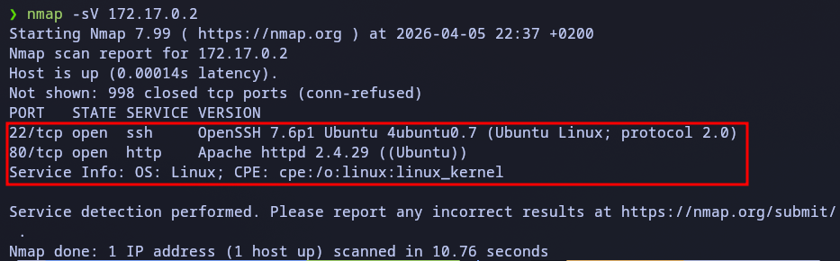
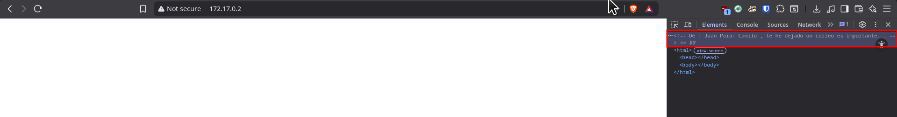
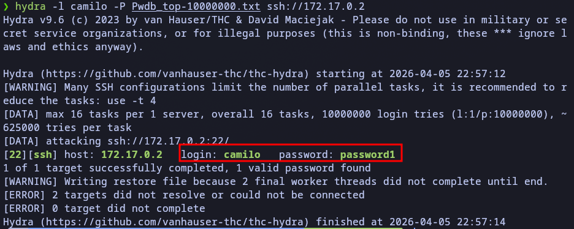
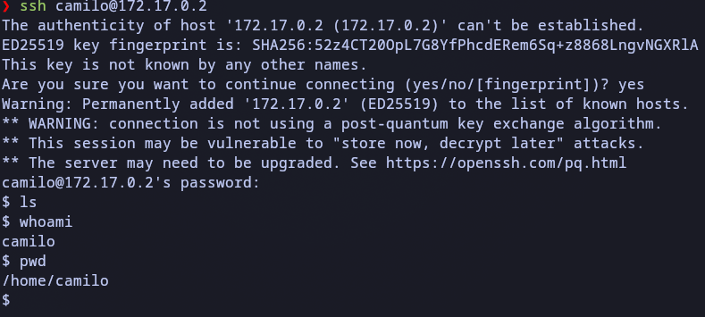
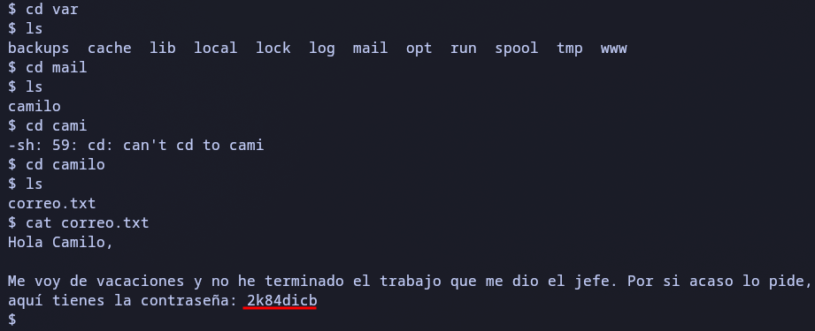
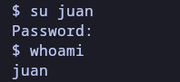
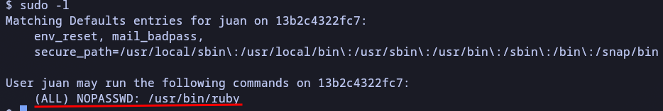

# Vacaciones lab

src: https://dockerlabs.es/

## Scanning and Enumeration
We start by checking which services are running on the victim host using nmap with the -sV flag to get the software versions.

Command: nmap -sV 



## Web Analysis
We enter to the web server and using dev tools to analize the code of an empty front, we can see a comment in the html.



Those two names probably are a user of a credential on the other services.

## Brute Forcing SSH
Now we try to brute force ssh with camilo and juan names as user credentials.



Now we have the credentials and we can enter ssh.



## Privilage Escalation

### Lateral Movement
After 5 minuts searching for something I remembered the comment in the HTML file and went to the mail directory 



This password should be the one from Juan so lets try logging in to his user



### Privilage Escalation

Now let's try to escalate through this user, first let's see which things hw can run as sudo (aka his permissions) with: 
```

sudo -l
```



We can run ruby, so lets execute a shell with ruby: 
```
sudo ruby -e 'exec "/bin/sh"'
```


Result: Root Access achieved.